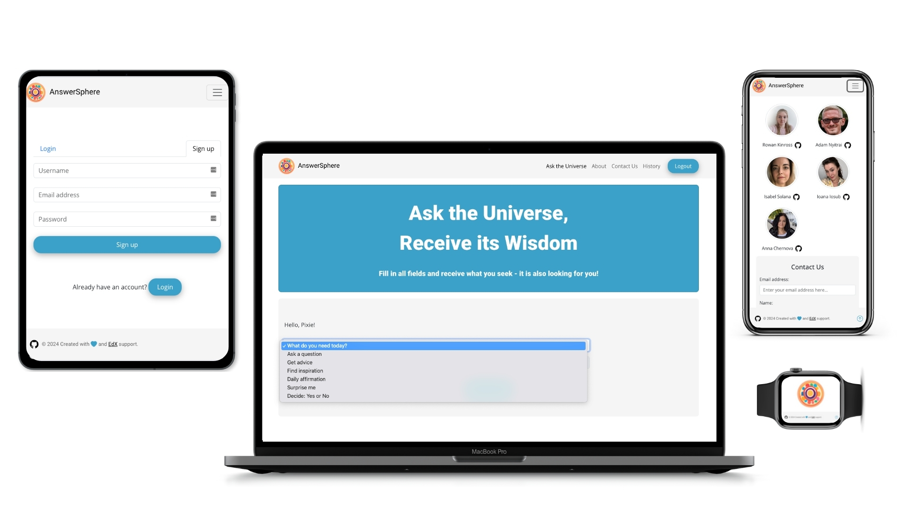
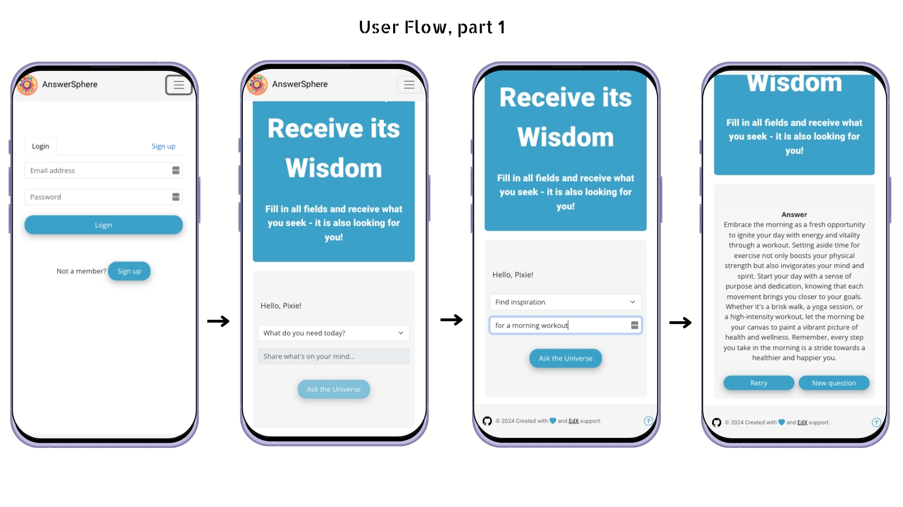
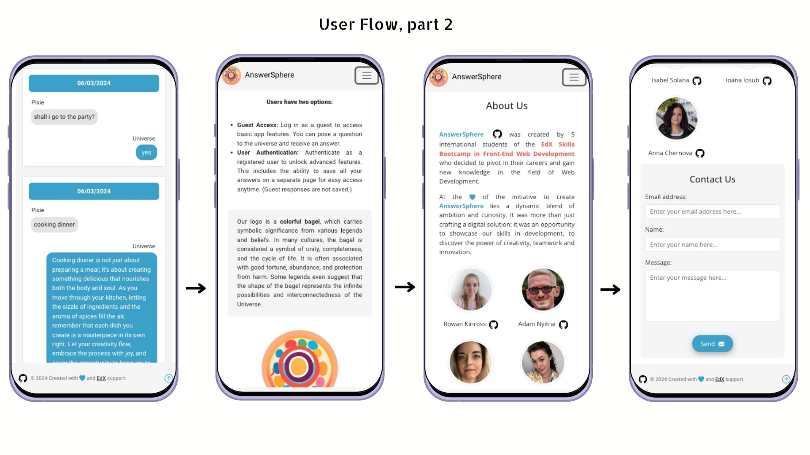
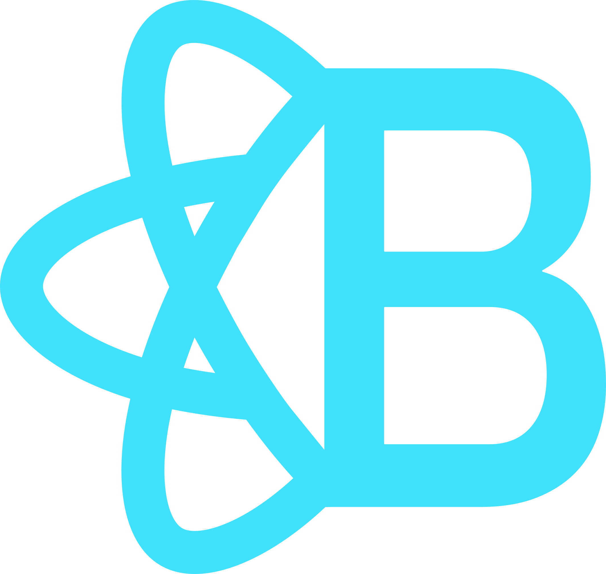
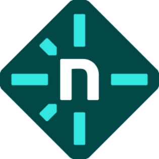

# AnswerSphere 

## Description
Our application is designed for those seeking answers to ther questions, seeking advice, daily affirmations, or resolving "yes" or "no" dilemmas. It's a magical pendulum for those awaiting signs from above -  and indeed, it's the sign itself. 

It was created by 5 students of the EdX Skills BootCamp, designed to showcase our skills and capabilities in front-end development.

 The website consists of four pages:
- ‘Ask the Universe’ page where the user will get personalized insights sourced from the universe according to its concerns or needs.
- ‘About’ page that informs the users about the 2 access options (Guest or User Authentication) and a brief explanation about the meaning of our logo.
- ‘Contact Us’ page that includes GitHub students' links and a contact form.
- ‘History’ page where logged users can have access to its answers.

## Table of Contents
- [Screenshots](#screenshots)
- [Links](#links)
- [Technologies used](#techs)
- [Dependencies](#dependencies)
- [Sources](#sources)

## Screenshots

## Links
[Link to the deployed application on Netlify](https://answersphere.netlify.app)

## Technologies used 

&nbsp;&nbsp;&nbsp;&nbsp;&nbsp;

&nbsp;&nbsp;&nbsp;&nbsp;&nbsp;

&nbsp;&nbsp;&nbsp;&nbsp;&nbsp;

&nbsp;&nbsp;&nbsp;&nbsp;&nbsp; 

&nbsp;&nbsp;&nbsp;&nbsp;&nbsp; 

&nbsp;&nbsp;&nbsp;&nbsp;&nbsp;
 
&nbsp;&nbsp;&nbsp;&nbsp;&nbsp;

&nbsp;&nbsp;&nbsp;&nbsp;&nbsp;

&nbsp;&nbsp;&nbsp;&nbsp;&nbsp;

- [OpenAI](https://www.npmjs.com/package/openai)
- [EmailJS](https://www.npmjs.com/package/emailjs)
- [React Router DOM](https://www.npmjs.com/package/react-router-dom)
- [React Toastify](https://www.npmjs.com/package/react-toastify)
- [Day.js](https://www.npmjs.com/package/dayjs)
- [Vitest](https://www.npmjs.com/package/vitest)
- [Netlify CLI](https://www.npmjs.com/package/netlify-cli)

## Sources
- [MDN Web Docs](https://developer.mozilla.org/en-US/)
- [ChatGPT](https://chat.openai.com/) to get help implementing Firebase and Firestore

