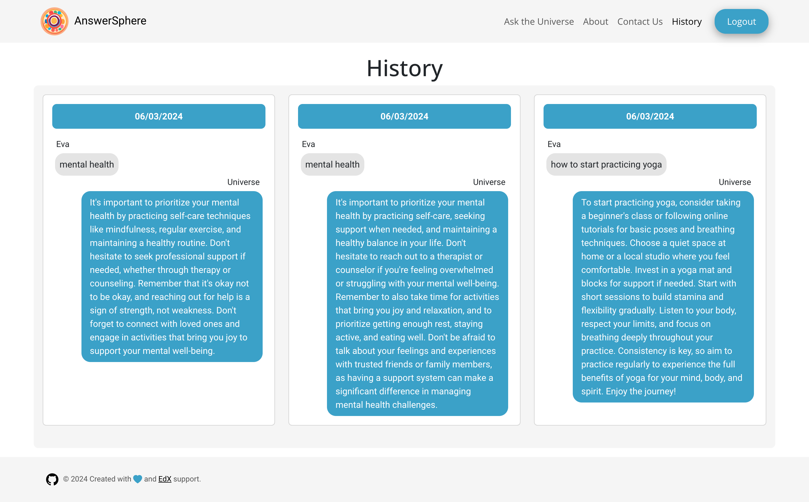

# AnswerSphere
[License](https://img.shields.io/badge/License-MIT-blue.svg) 

## Description

Our application is designed for those seeking answers to ther questions, seeking advice, daily affirmations, or resolving "yes" or "no" dilemmas. It's a magical pendulum for those awaiting signs from above -  and indeed, it's the sign itself. 

It was created by 5 students of the EdX Skills BootCamp , designed to showcase our skills and capabilities in front-end development.

 The website consists of four pages:
- ‘Ask the Universe’ page where the user will get personalized insights sourced from the universe according to its concerns or needs.
- ‘About’ page that informs the users about the 2 access options (Guest or User Authentication) and a brief explanation about the meaning of our logo.
- ‘Contact Us’ page that includes GitHub students' links and a contact form.
- ‘History’ page where logged users can have access to its answers.

## Table of Contents

- [Screenshots](#screenshots)
- [Links](#links)
- [Technologies used](#techs)
- [Dependencies](#dependencies)
- [Sources](#sources)

## Screenshots

Screenshot of the Ask the Universe page

Screenshot of the About page

Screenshot of the Contact Us page

Screenshot of the History page

## Links

[Link to the deployed application in Netlify](https://answersphere.netlify.app)

[Link to the deployed application in GitHub]()

## Technologies used 

&nbsp;&nbsp;&nbsp;&nbsp;&nbsp;

&nbsp;&nbsp;&nbsp;&nbsp;&nbsp;

&nbsp;&nbsp;&nbsp;&nbsp;&nbsp;

&nbsp;&nbsp;&nbsp;&nbsp;&nbsp; 

&nbsp;&nbsp;&nbsp;&nbsp;&nbsp;
 

&nbsp;&nbsp;&nbsp;&nbsp;&nbsp;

&nbsp;&nbsp;&nbsp;&nbsp;&nbsp;

&nbsp;&nbsp;&nbsp;&nbsp;&nbsp;

## Dependencies

- [EmailJS](https://www.npmjs.com/package/emailjs)
- [react-router-dom](https://www.npmjs.com/package/react-router-dom)
- [OpenAI](https://www.npmjs.com/package/openai)
- [React-Toastify](https://www.npmjs.com/package/react-toastify)
- [BootStrap](https://www.npmjs.com/package/bootstrap)
- [DayJS](https://www.npmjs.com/package/dayjs)

## Sources
MDN  Web Docs: Rosources for Developers by Developers
- [MDN](https://developer.mozilla.org/en-US/)

